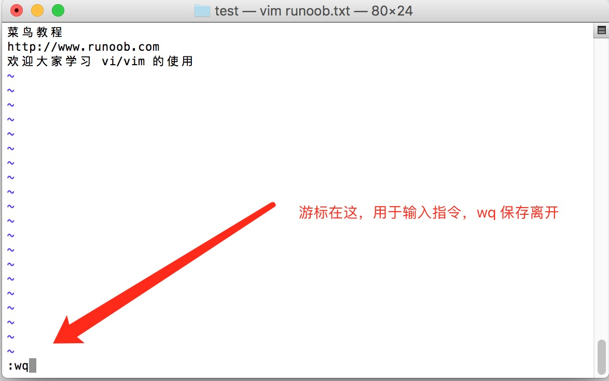

# VIM 学习

## 什么是vim？

Vim 是从 vi 发展出来的一个文本编辑器。代码补全、编译及错误跳转等方便编程的功能特别丰富，在程序员中被广泛使用。

简单的来说， vi 是老式的字处理器，不过功能已经很齐全了，但是还是有可以进步的地方。 vim 则可以说是程序开发者的一项很好用的工具。

连 vim 的官方网站 (https://www.vim.org/) 自己也说 vim 是一个程序开发工具而不是文字处理软件。  

## vi/vim 介绍

刚开始用 VIM 打开文件的时候，需要从宏观的去了解一下 VIM 这个编辑器。

VIM 常用的有四个模式:

- 正常模式 (Normal-mode)
- 插入模式 (Insert-mode)
- 命令模式 (Command-mode)
- 可视模式 (Visual-mode)  

### 正常模式

正常模式一般用于浏览文件，也包括一些复制、粘贴、删除等操作。这时击键时，一些组合键就是 vim 的功能键，而不会在文本中键入对应的字符。

在这个模式下，我们可以通过键盘在文本中快速移动光标，光标范围从小到大是字符、单词、行、句子、段落和屏幕。启动 VIM 后默认位于正常模式。不论是什么模式，按一下 **Esc** 键 (有时可能需要按两下，插入模式按一下 **Esc** ，就会切换到正常模式，命令模式或者可视模式下执行完操作以后，就会自动进入正常模式，如果进入命令模式或者可视模式没有执行任何操作，按两下 **Esc** 即可)都会进入正常模式。

下面的三个模式都是过键盘上相应的键位去触发的。  

### 插入模式

在正常模式中按下个别字母键（后面会详细介绍），会进入插入模式。

例如按 **i** 键会进行插入模式。该模式启动以后，就会进入编辑状态，通过键盘输入内容。

### 命令模式

在正常模式中，按下 **\:**（冒号）键或者/ （斜杠），会进入命令模式。在命令模式中可以执行一些输入并执行一些 VIM 或插件提供的指令，就像在shell里一样。这些指令包括设置环境、文件操作、调用某个功能等等。  

### 可视模式

在正常模式按下**v**, **V**, **Ctrl+v**，可以进入可视模式。可视模式中的操作有点像拿鼠标进行操作，选择文本的时候有一种鼠标选择的即视感，有时候会很方便。

以上是关于 VIM 四种模式的解读，我们在使用 VIM 操作文本的时候，编辑区底部一般都会显示当前处于什么模式下（插入模式会有 INSERT 提示，可视模式会有 VISUAL 或者 VISUAL LINE 的提示）。  

