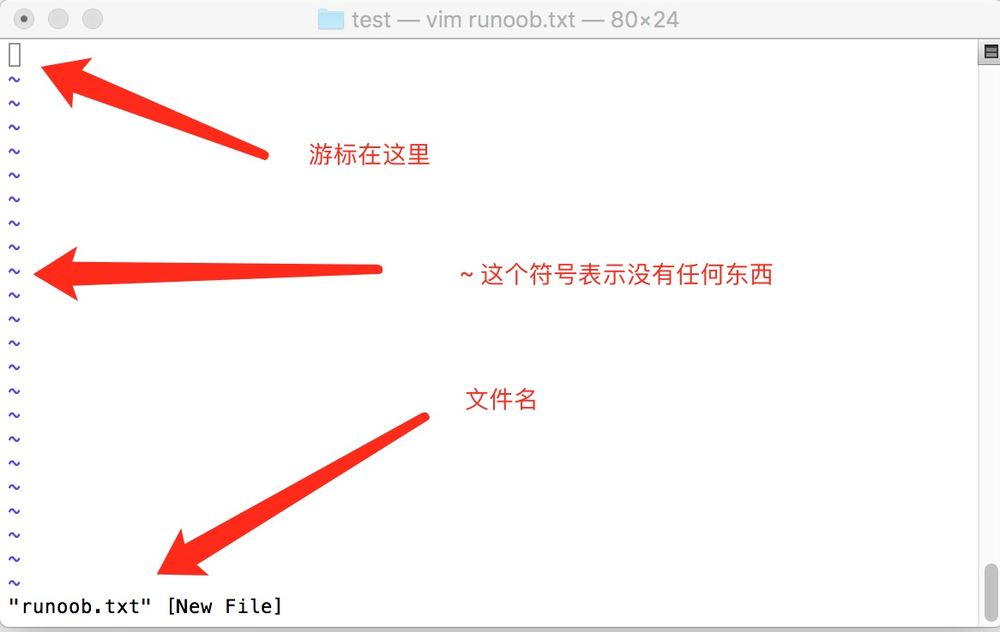

# VIM 学习

## 什么是vim？

Vim 是从 vi 发展出来的一个文本编辑器。代码补全、编译及错误跳转等方便编程的功能特别丰富，在程序员中被广泛使用。

简单的来说， vi 是老式的字处理器，不过功能已经很齐全了，但是还是有可以进步的地方。 vim 则可以说是程序开发者的一项很好用的工具。

连 vim 的官方网站 (https://www.vim.org/) 自己也说 vim 是一个程序开发工具而不是文字处理软件。  

## vi/vim 介绍

刚开始用 VIM 打开文件的时候，需要从宏观的去了解一下 VIM 这个编辑器。

VIM 常用的有四个模式:

- 正常模式 (Normal-mode)
- 插入模式 (Insert-mode)
- 命令模式 (Command-mode)
- 可视模式 (Visual-mode)  

### 正常模式

正常模式一般用于浏览文件，也包括一些复制、粘贴、删除等操作。这时击键时，一些组合键就是 vim 的功能键，而不会在文本中键入对应的字符。

在这个模式下，我们可以通过键盘在文本中快速移动光标，光标范围从小到大是字符、单词、行、句子、段落和屏幕。启动 VIM 后默认位于正常模式。不论是什么模式，按一下 **Esc** 键 (有时可能需要按两下，插入模式按一下 **Esc** ，就会切换到正常模式，命令模式或者可视模式下执行完操作以后，就会自动进入正常模式，如果进入命令模式或者可视模式没有执行任何操作，按两下 **Esc** 即可)都会进入正常模式。

下面的三个模式都是过键盘上相应的键位去触发的。  

### 插入模式

在正常模式中按下个别字母键（后面会详细介绍），会进入插入模式。

例如按 **i** 键会进行插入模式。该模式启动以后，就会进入编辑状态，通过键盘输入内容。

### 命令模式

在正常模式中，按下 **\:**（冒号）键或者/ （斜杠），会进入命令模式。在命令模式中可以执行一些输入并执行一些 VIM 或插件提供的指令，就像在shell里一样。这些指令包括设置环境、文件操作、调用某个功能等等。  

### 可视模式

在正常模式按下**v**, **V**, **Ctrl+v**，可以进入可视模式。可视模式中的操作有点像拿鼠标进行操作，选择文本的时候有一种鼠标选择的即视感，有时候会很方便。

以上是关于 VIM 四种模式的解读，我们在使用 VIM 操作文本的时候，编辑区底部一般都会显示当前处于什么模式下（插入模式会有 INSERT 提示，可视模式会有 VISUAL 或者 VISUAL LINE 的提示）。  

## vim 使用

### 如何用 VIM 去打开一个文件呢？

现在假如有一个文件 file1 ,只需要在文件前面加上 vim 关键字就好：

`` vim file1 ``

上面这个命令将会打开 file1 这个文件，file1 是指你具体操作的文件名。  

### 如何用 VIM 一次性打开多个文件呢？

现在有多个文件 file1 ，file2 , ... ,filen.
现在举例打开两个文件 file1，file2

`` vim file1 file2 ``

该方式打开文件，显示屏默认显示第一个文件也就是 file1，如何进行文件间的切换呢？VIM 的正常模式下（参考上文关于正常模式的描述）按下键盘上的冒号 **：**这时会在显示屏底部出现冒号 **：**（进入了 VIM 的命令模式），然后在输入 **ls** ，屏幕上会出现打开的所有文件的序号和文件名，我们继续输入冒号 **：** ，然后输入 bn (这里的 n需要做一个解释并不是键盘上的 n ,而是文件序号的代指，如 b1 代表显示屏上切换到第一个文件，b2 代表显示屏上切换到第二个文件)。

`` :ls ``

上面这个命令将会列出 VIM 打开的所有文件。

`` :b2 ``

上面的这个命令将会在显示屏上显示第二个文件。  

### 如何在显示屏上一次性显示多个文件呢？

VIM 可以实现分屏操作，一个屏幕被多个文件给分占，有左右和上下两种分屏的方式。
左右分屏如下操作：

`` vim -On file1 file2 ... filen ``

这里的 n （ n 是要打开的具体文件的数目：1,2,3 ...）是代表有几个文件需要分屏，从左至右依次显示 n 个文件。
上下分屏如下操作：

`` vim -on file1 file2 ... filen ``

这个命令跟上一个命令不同的是其中的参数 -on（ n 是要打开的具体文件的数目：1,2,3 ...） 中的 o 是小写，这样将会上下依次显示 n 个文件。  

### VIM 如何进行分屏操作呢？

请记住一个重要的组合键 **Ctrl + w** ,操作分屏离不开这个组合键(这里的组合键可没有 + ，只是 Ctrl 和 w 组合实现一个动能,下文谈到的组合健都这样描述 )。
按住组合键 Ctrl + w ，然后在按下 s

`` Ctrl + w s ``

上面这个命令将会上下分割当前打开的文件。
按住冒号：，紧接着输入 sp ,在键入文件名，如下：

`` :sp file ``

上面的这个命令将会上下分割当前文件和新打开的 file 。
按住组合键 Ctrl + w ,然后在按下 v

`` Ctrl +w v ``

上面的这个命令将会左右分割当前的文件
按住冒号 ：，紧接着输入 vsp ,在键入文件名称，如下：

`` :vsp file ``

上面的这个命令将会左右分割当前打开的文件和新打开的文件 file 。  

### 分屏以后如何在文件间切换光标，和移动分屏？

1.切换左右分屏的光标 ：

`` Ctrl + w h ``

将当前光标定位到左边的屏幕

`` Ctrl + w l ``

将当前的光标定位到右边的屏幕
2.移动左右分屏 ：

`` Ctrl + w H ``

将当前的分屏移动到左边

`` Ctrl + w L ``

将当前的分屏移动到右边
3.切换上下分屏的光标 ：

`` Ctrl + w j ``

将当前的光标移动到下面的分屏

`` Ctrl + w k ``

将当前光标移动到上面的分屏
4.移动上下分屏：

`` Ctrl + w J ``

将当前的分屏移动到下面的分屏

`` Ctrl + w K ``

将当前的分屏移动到上面的分屏  

### 如何关闭分屏呢？

`` Ctrl + w c ``

上面这个命令是关闭当前的分屏

`` Ctrl + w q ``

上面的这个命令也是关闭当前的分屏，如果是最后一个分屏将会退出 VIM 。  

### VIM 的退出

VIM 的最终操作就是 VIM 的退出，如何进行 VIM 的有效退出呢？下面针对 VIM 的退出来做一下说明：

`` :w ``

保存当前对文件的修改，但是不退出文件。

`` :w! ``

强制保存但是不退出文件。

`` :w file ``

保存当前的文件修改到 file 文件当中。

`` :q! ``

退出文件，对文件的修改不做保存。

`` :qa! ``

退出所有的文件，对所有的文件修改都不做保存。

`` :wq ``

退出文件并保存对文件的修改。

`` :x ``

退出文件并保存对文件的修改。

`` :e file ``

打开另一个文件。

`` :e! ``

放弃对文件的所有修改，恢复文件到上次保存的位置。

`` :saveas file ``

另存为 file。

`` :bn 和 :bp ``

当打开多个文件的时候可以输入 :bn 和 :bp 进行上一个文件或者下一个文件的切换。
以上的命令都是在命令行模式下的操作（也就是输入冒号 ：紧接着输入相应的字符命令如 :q! 就会执行退出操作）。 zempty 在这里要推荐一个常用的操作就是 ZZ , 当你对文件进行了修改，需要保存退出，那么可以在键盘上快速的键入两个大写的 Z (ZZ),这样文件就会快速的保存退出了。  

## VIM 的输入模式

编辑器的主要功能就是输入文本，编辑文本，很多编辑器在打开文件的时候就可以通过键盘录入文字，但是 VIM 有稍许的不同，刚刚接触 VIM 的时候是很难对 VIM 进行编辑操作的，记得我在刚接触它的时候是很崩溃的（千万个草泥马在内心奔腾），但是你接触久了，了解的多了，也就理解如此设计的美妙之处。  

### 如何使用 VIM 编辑文本？

这里有必要再强调一下，在使用 VIM 打开文件的时候，这时候的状态是正常模式（Normal-mode）,请务必记住这个模式，如果你不确定当前是否处在正常模式，请连续按两下键盘上的 jj (这个 jj 需要读者去做相应的配置，上文有做过讲解)，VIM 处理编辑文本需要从正常模式(Normal)切换到插入模式(Insert-mode),进入插入模式的时候你应该会在屏幕底部看到 **INSERT** 的提示，这时候就可以编辑文本了。  

### 如何从正常模式进入插入模式呢？

请记住下面几个常用启动录入文本的键盘字符 i,I,a,A,o,O,s,S 。

**i** 是在光标所在的字符之前插入需要录入的文本。

**I** 是在光标所在行的行首插入需要录入的文本。

**a** 是在光标所在的字符之后插入需要录入的文本。

**A** 是在光标所在行的行尾插入需要录入的文本。

**o** 是光标所在行的下一行行首插入需要录入的文本。

**O** 是光标所在行的上一行行首插入需要录入的文本。

**s** 删除光标所在处的字符然后插入需要录入的文本。

**S** 删除光标所在行，在当前行的行首开始插入需要录入的文本。

还有一个可能经常用到的就是 **cw** ，删除从光标处开始到该单词结束的所有字符，然后插入需要录入的文本（这个命令是两个字符的合体 cw ）。  

## VIM 的命令模式

关于命令模式上文有提到过，下面主要来列举几个常用的命令模式操作（命令输入完以后，需要按下 Enter 键去执行命令）：  

### 文本的行号

`` :set nu ``

该命令会显示行号。

`` :set nonu ``

该命令会取消行号。

`` :n ``

定位到 n 行。  

### VIM 进行关键字的查找

`` /{目标字符串} ``

如：/zempty 会在文本中匹配 zempty 的地方高亮。
查找文本中匹配的目标字符串，查到以后，输入键盘上的 n 会去寻找下一个匹配，N 会去寻找上一个匹配。  

### VIM 处理大小写的区分

`` :set ic ``

编辑器将不会区分大小写，如果你进行该设置之后，进行关键字查询如 /zempty 如果文本中有 Zempty ,zEmpty,....,只要是字符相同不会区分大小写都会进行匹配。

`` :set noic ``

该命令用来区分大小写的查询。  

### VIM 删除多行文本

`` :n1,n2d ``

n1 和 n2 指的是起始行号和结束行号，d 是删除关键字。  

## VIM 的正常模式

VIM 正常模式下，主要进行的操作有光标的移动，复制文本，删除文本，黏贴文本等。

### 快速移动光标

请记住这几个快捷键 **h, j, k, l** 这几个按键主要是用来快速移动光标的，h 是向左移动光标，l 是向右移动光标，j 是向下移动光标，k 是向上移动光标，h , j , k ,l 在主键盘区完全可以取代键盘上的 ↑ ,↓ ,← , → 的功能。  

### 在当前行上移动光标

**0** 移动到行头

**^** 移动到本行的第一个不是 blank 字符

**$** 移动到行尾

**g_** 移动到本行最后一个不是 blank 字符的位置

**w** 光标移动到下一个单词的开头

**e** 光标移动到下一个单词的结尾

**fa** 移动到本行下一个为 a 的字符处，fb 移动到下一个为 b 的字符处

**nfa** 移动到本行光标处开始的第 n 个 字符为 a 的地方（n 是 1，2，3，4 ... 数字）

**Fa** 同 fa 一样，光标移动方向同 fa 相反

**nFa** 同 nfa 类似，光标移动方向同 nfa相反

**ta** 移动光标至 a 字符的前一个字符

**nta** 移动到第二个 a 字符的前一个字符处

**Ta** 同 ta 移动光标方向相反

**nTa** 同 nta 移动光标方向相反

**;** 和, 当使用 f, F, t ,T, 关键字指定字符跳转的时候，使用 ；可以快速跳转到下一个指定的字符，, 是跳到前一个指定的字符  

### 跨行移动光标

**nG** 光标定位到第 n 行的行首

**gg** 光标定位到第一行的行首

**G** 光标定位到最后一行的行首

**H** 光标定位到当前屏幕的第一行行首

**M** 光标移动到当前屏幕的中间

**L** 光标移动到当前屏幕的尾部

**zt** 把当前行移动到当前屏幕的最上方，也就是第一行

**zz** 把当前行移动到当前屏幕的中间

**zb** 把当前行移动到当前屏幕的尾部

**%** 匹配括号移动，包括 **( , { , [** 需要把光标先移动到括号上

\* 和 **#** 匹配光标当前所在的单词，移动光标到下一个（或者上一个）匹配的单词（* 是下一个，# 是上一个）  

### 翻页操作

**ctrl+f** 查看下一页内容

**ctrl+b** 查看上一页内容  

### VIM 的复制，黏贴 ，删除

三个重要的快捷键 **d , y , p**

**d** 是删除的意思，通常搭配一个字符 ( 删除范围 ) 实现删除功能，常用的如下：

**dw** 删除一个单词

**dnw** 删除 n 个单词，

**dfa** 删除光标处到下一个 a 的字符处（ fa 定位光标到 a 处 ）

**dnfa** 删除光标处到第 n 个 a 的字符处

**dd** 删除一整行

**ndd** 删除光标处开始的 n 行

**d$** 删除光标到本行的结尾

**dH** 删除屏幕显示的第一行文本到光标所在的行

**dG** 删除光标所在行到文本的结束

**y** 是复制的意思，通常搭配一个字符（复制范围）实现复制的功能，常用的如下：

**yw** 复制一个单词，还有 ynw

**yfa** 复制光标到下一个 a 的字符处,还有ynfa

**yy** 复制一行，还有 nyy

**y$** 复制光标到本号的结尾

**yH** 复制屏幕显示的第一行文本到光标所在的行

**yG** 复制光标所在行到文本的结束

**p** P是黏贴的意思，当执行完复制或者黏贴的命令以后，VIM 会把文本寄存起来。

**p** 在光标后开始黏贴

**P** 大写的 P 光标前开始粘贴  

### 撤销操作和恢复

u 撤销刚才的操作

ctrl + r 恢复撤销操作  

### 删除字符操作和替换

**x** 删除光标当前所在的字符

**r** 替换掉光标当前所在的字符

**R** 替换掉从光标开始以后的所有字符，除非 **ESC** 退出，或者 jj （代替 **ESC** 上文有提到）退出。  

### 大小写转换

**~** 将光标下的字母改变大小写

**3~** 将光标位置开始的3个字母改变其大小写

**g~~** 改变当前行字母的大小写

**gUU** 将当前行的字母改成大写

**guu** 将当前行的字母全改成小写

**3gUU** 将从光标开始到下面3行字母改成大写

**gUw** 将光标下的单词改成大写。

**guw** 将光标下的单词改成小写  
### VIM 的重复命令

. 该命令是重复上一个操作的命令

n \<command\>重复某个命令 n 次，
如 10p复制 10 次，10dd 删除十次。
